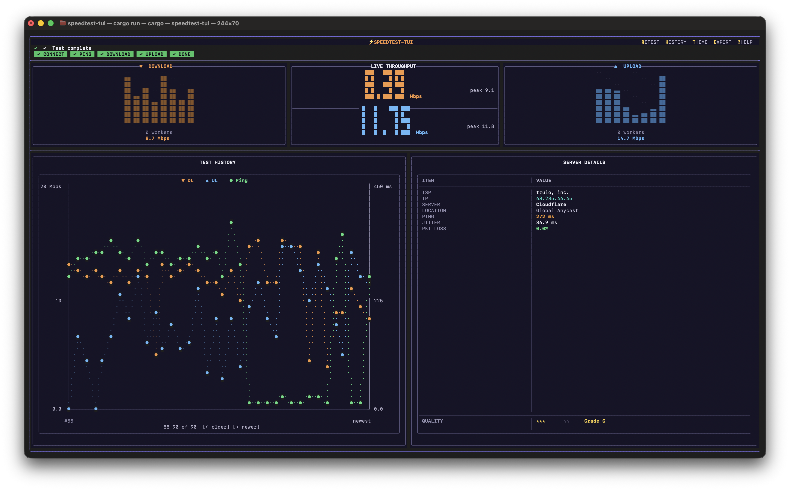

# ⚡speedtest-tui

[](https://www.rust-lang.org/)
[](https://ratatui.rs)
[](https://tokio.rs)
[](LICENSE)
[](CONTRIBUTING.md)

`speedtest-tui` is a terminal-first internet speed test built with Rust, `tokio`, and `ratatui`.
It runs ping, download, and upload checks against Cloudflare endpoints and presents the results in a polished dashboard with live worker bars, a dual-axis history chart, and a structured server details panel.

## Screenshot



## Features

- Live dashboard with `DOWNLOAD`, `LIVE THROUGHPUT`, `UPLOAD`, `TEST HISTORY`, and `SERVER DETAILS` panels
- Multi-worker download and upload visualization with per-worker bar histograms
- Latency, jitter, and packet loss measurement before throughput testing
- Dual-axis history chart in the main dashboard:
  - Download and upload on the left axis in Mbps
  - Ping on the right axis in ms
- In-memory and persisted test history with a dedicated full-screen history view
- Runtime dark/light theme toggle
- JSON and CSV export support
- Quiet mode for scriptable output
- Local quality score with stars and letter grade

## Requirements

- Rust 1.75+ if building from source
- A Unicode-capable terminal with 256-color support
- Internet access to:
  - `speed.cloudflare.com`
  - `ipwho.is`

## Installation

### Prebuilt Binaries

If you do not want to install Rust or compile from source, download a prebuilt binary from the [Releases](https://github.com/abelsileshi/speedtest-tui/releases) page.

#### Available packages

| Operating system | Package |
|---|---|
| Linux (x86_64) | `speedtest-tui-linux-x86_64.tar.gz` |
| Linux (ARM64) | `speedtest-tui-linux-aarch64.tar.gz` |
| macOS (Apple Silicon) | `speedtest-tui-macos-aarch64.tar.gz` |
| macOS (Intel) | `speedtest-tui-macos-x86_64.tar.gz` |
| Windows (x86_64) | `speedtest-tui-windows-x86_64.zip` |

#### Install on Linux or macOS

```bash
tar -xzf speedtest-tui-macos-aarch64.tar.gz
chmod +x speedtest-tui
sudo mv speedtest-tui /usr/local/bin/
speedtest-tui
```

Replace the archive name with the one that matches your platform.

On macOS, if Gatekeeper blocks the binary on first launch:

```bash
xattr -dr com.apple.quarantine /usr/local/bin/speedtest-tui
```

#### Install on Windows

1. Download and extract `speedtest-tui-windows-x86_64.zip`.
2. Open the extracted folder in Windows Terminal or PowerShell.
3. Run:

```powershell
.\speedtest-tui.exe
```

Windows Terminal is recommended for correct Unicode and color rendering.

### Build from source

```bash
git clone https://github.com/abelsileshi/speedtest-tui.git
cd speedtest-tui
cargo build --release
```

The binary will be available at `target/release/speedtest-tui`.

### Optional local install

```bash
cargo install --path .
```

## Usage

### Start the TUI

```bash
speedtest-tui
```

Or during development:

```bash
cargo run
```

### CLI options

From the current binary:

| Flag | Short | Description |
|---|---|---|
| `--server <ID>` | `-s` | Use a specific test server ID |
| `--no-upload` | `-n` | Skip the upload phase |
| `--quiet` | `-q` | Run without the TUI and print JSON on exit; currently skips ping and quality scoring |
| `--export <FORMAT>` | `-e` | Export results as `json`, `csv`, or `png` |
| `--theme <THEME>` | `-t` | Force `dark` or `light` theme at launch |
| `--help` | `-h` | Print help |
| `--version` | `-V` | Print version |

### Examples

```bash
# Standard dashboard run
speedtest-tui

# Skip upload
speedtest-tui --no-upload

# Force light theme
speedtest-tui --theme light

# Quiet mode JSON
speedtest-tui --quiet

# Export the current run as CSV
speedtest-tui --export csv
```

## Keyboard Shortcuts

### Main dashboard

| Key | Action |
|---|---|
| `R` | Restart the test |
| `H` | Open full history view |
| `T` | Toggle dark/light theme |
| `E` | Export the current result as JSON |
| `?` | Open help |
| `Left` | Page history graph toward older entries |
| `Right` | Page history graph toward newer entries |
| `Home` | Jump dashboard history graph to the oldest window |
| `End` | Follow the newest dashboard history window |
| `Q` | Quit |
| `Esc` | Close help/history, or quit from the dashboard |
| `Ctrl-C` | Force quit |

### Full history view

| Key | Action |
|---|---|
| `Up` / `Down` | Scroll saved results |
| `Q` / `Esc` | Return to the dashboard |

## UI Layout

The dashboard is organized into three layers:

1. Top chrome:
   - centered app title
   - action hints for retest, history, theme, export, and help
   - stage pills showing connectivity, ping, download, upload, and done status
2. Throughput row:
   - `DOWNLOAD` worker histogram
   - `LIVE THROUGHPUT` big numeric DL/UL readouts with peak values
   - `UPLOAD` worker histogram
3. Bottom row:
   - `TEST HISTORY` dual-axis overlay chart with paging
   - `SERVER DETAILS` table with ISP, IP, server, location, ping, jitter, packet loss, and quality

## Configuration

The app loads configuration from the platform config directory if the file exists. Otherwise it uses defaults.

### Paths

| Platform | Config file | History file |
|---|---|---|
| Linux | `~/.config/speedtest-tui/config.toml` | `~/.local/share/speedtest-tui/history.json` |
| macOS | `~/Library/Application Support/speedtest-tui/config.toml` | `~/Library/Application Support/speedtest-tui/history.json` |
| Windows | `%APPDATA%\speedtest-tui\config\config.toml` | `%APPDATA%\speedtest-tui\data\history.json` |

### Current config shape

```toml
theme = "auto"        # dark | light | auto
parallel_workers = 8
ping_count = 100
test_duration_secs = 10
preferred_server = "" # server ID or empty for auto-select
```

Notes:

- `theme = "light"` starts in light mode.
- Any other config theme value currently starts in the dark theme unless overridden with `--theme`.

## History and Export

### Saved history

Each completed TUI run is appended to `history.json`.

- The file keeps up to `1000` entries
- The dashboard chart shows a sliding window of saved runs
- `H` opens the full history list with timestamps and metrics

### Dashboard history chart

The main `TEST HISTORY` panel plots:

- `DL` in orange on the left axis in Mbps
- `UL` in blue on the left axis in Mbps
- `Ping` in green on the right axis in ms

This lets you compare throughput changes against latency spikes without scaling ping into fake throughput units.

### Export behavior

- `E` in the TUI exports the current result to JSON
- `--export json` writes `speedtest-result.json`
- `--export csv` appends to `speedtest-results.csv`
- `--export png` is accepted by the CLI, but the current implementation is still a placeholder and prints `PNG export: not yet implemented.`

### Quiet mode

Quiet mode prints a JSON object and does not render the TUI:

```bash
speedtest-tui --quiet | jq
```

The current quiet-mode implementation is intended for automation and file export. It does not render live charts or the interactive dashboard.

Current quiet-mode limitations:

- it skips the ping phase
- `ping_ms`, `jitter_ms`, and `packet_loss_pct` are emitted as `0.0`
- `quality_score` is emitted as `0.0`
- `quality_grade` is emitted as `N/A`

## Result Format

Saved history entries and JSON exports use this shape:

```jsonc
{
  "timestamp": "2026-06-09T10:27:00Z",
  "isp": "tzulo, inc.",
  "ip": "23.234.99.192",
  "location": "Ashburn, US",
  "server_name": "Cloudflare",
  "server_host": "speed.cloudflare.com",
  "ping_ms": 193.0,
  "jitter_ms": 10.1,
  "packet_loss_pct": 0.0,
  "download_mbps": 13.32,
  "upload_mbps": 5.74,
  "quality_score": 3.25,
  "quality_grade": "C"
}
```

CSV columns:

```text
timestamp,isp,ip,location,server,ping_ms,jitter_ms,packet_loss_pct,download_mbps,upload_mbps,grade
```

## Quality Score

The server panel shows a star rating and grade derived from four equal-weight inputs:

- ping
- download speed
- upload speed
- packet loss

Current score thresholds in code:

### Ping score

| Value | Score |
|---|---|
| `< 20 ms` | 5 |
| `< 50 ms` | 4 |
| `< 100 ms` | 3 |
| `< 150 ms` | 2 |
| `>= 150 ms` | 1 |

### Download score

| Value | Score |
|---|---|
| `> 200 Mbps` | 5 |
| `> 50 Mbps` | 4 |
| `> 10 Mbps` | 3 |
| `> 2 Mbps` | 2 |
| `<= 2 Mbps` | 1 |

### Upload score

| Value | Score |
|---|---|
| `> 50 Mbps` | 5 |
| `> 10 Mbps` | 4 |
| `> 3 Mbps` | 3 |
| `> 1 Mbps` | 2 |
| `<= 1 Mbps` | 1 |

### Packet loss score

| Value | Score |
|---|---|
| `0%` | 5 |
| `< 1%` | 4 |
| `< 3%` | 3 |
| `< 5%` | 2 |
| `>= 5%` | 1 |

The final letter grade is derived from the averaged numeric score:

| Average bucket | Grade |
|---|---|
| `5` | `A` |
| `4` | `B` |
| `3` | `C` |
| `2` | `D` |
| everything else | `F` |

## Architecture

### Source tree

```text
src/
├── main.rs
├── cli.rs
├── config.rs
├── app/
│   ├── events.rs
│   ├── metrics.rs
│   ├── mod.rs
│   └── state.rs
├── network/
│   ├── download.rs
│   ├── mod.rs
│   ├── ping.rs
│   ├── server.rs
│   └── upload.rs
├── storage/
│   ├── export.rs
│   ├── history.rs
│   └── mod.rs
└── ui/
    ├── dashboard.rs
    ├── history.rs
    ├── mod.rs
    └── theme.rs
```

### Runtime flow

1. Fetch IP / ISP metadata
2. Select the best server
3. Run ping sampling
4. Run download workers
5. Run upload workers unless `--no-upload` is set
6. Persist the final result and refresh history

### Current network endpoints

| Purpose | Endpoint |
|---|---|
| IP / ISP lookup | `https://ipwho.is/` |
| Server latency probe | `https://<host>/cdn-cgi/trace` |
| Download test | `https://speed.cloudflare.com/__down?bytes=<size>` |
| Upload test | `https://speed.cloudflare.com/__up` |

## Development

### Common commands

```bash
cargo build
cargo run
cargo fmt
cargo clippy -- -D warnings
```

### Debug logging

```bash
RUST_LOG=debug cargo run 2>debug.log
```

## FAQ

### Why does the app sometimes show `Unknown ISP` or `Unknown location`?

The speed test continues even if the IP/ISP lookup fails. In that case the UI falls back to neutral placeholders instead of treating it as a hard error. The current implementation also honors `Retry-After` when `ipwho.is` rate-limits requests, so it stops retrying until the cooldown expires.

### Why is my quality grade lower than expected?

The grade is not based on speed alone. High latency or packet loss can pull the score down even when download throughput is good.

### Why does `--export png` not create an image yet?

The CLI flag exists, but PNG export is not implemented in the current codebase.

### What terminal works best?

Use a terminal with Unicode and 256-color support such as iTerm2, Kitty, Alacritty, GNOME Terminal, or Windows Terminal.

## License

MIT. See [LICENSE](LICENSE).
